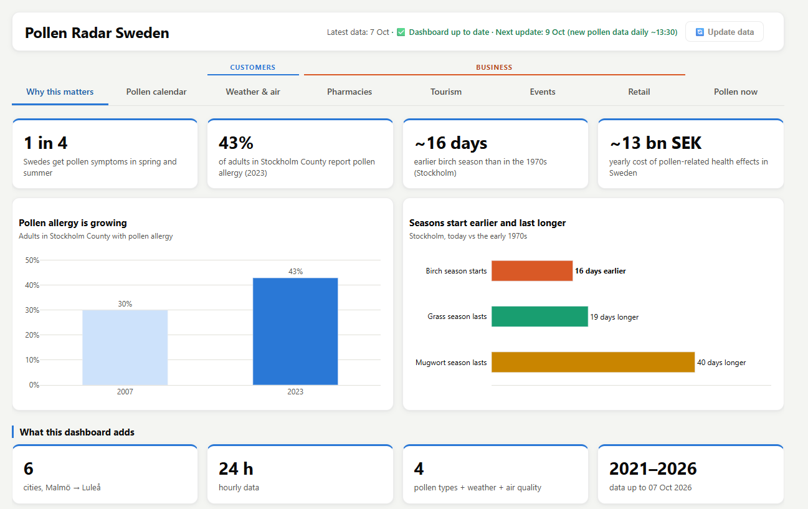
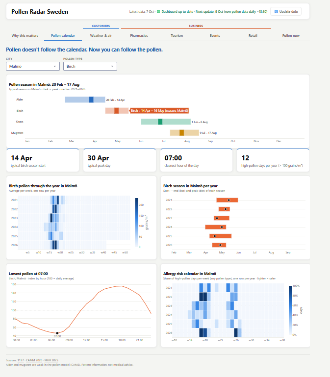
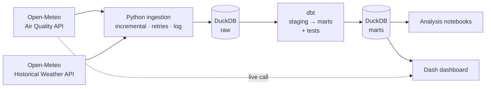

# Pollen Radar Sweden

**Breathe smarter.** When, where and why pollen is high in Sweden – city by city, hour by hour.

An end-to-end data project: an automated pipeline that collects hourly **pollen, air quality and weather** data for six Swedish cities, models it with **dbt** in **DuckDB**, and serves it in an interactive **Dash (Plotly)** dashboard for people with allergies and for businesses (pharmacies, tourism, outdoor events and retail).

**Live dashboard:** https://pollen-radar-sweden.onrender.com (free plan: the first visit can take ~30–60 s while the server wakes up)

---

## Why this matters

- About **1 in 4** people in Sweden get pollen symptoms in spring and summer (1177).
- In Stockholm County, adults reporting pollen allergy rose from **30 % (2007) to 43 % (2023)** (Miljöhälsoenkäten, CAMM Miljöhälsorapport 2025).
- The birch season in Stockholm starts **~16 days earlier** than in the 1970s, and grass and mugwort seasons are longer (CAMM 2026).
- Pollen-related health effects cost Sweden **~13 billion SEK per year** (CAMM 2026).

Pollen seasons move every year and differ by hundreds of kilometres between the south and the north. Fixed calendar dates are not good enough – neither for an allergy sufferer planning a run, nor for a pharmacy planning its stock.

## Business questions

| Who | Question |
|---|---|
| People with allergies | When does each pollen season start, peak and end in my city? Which hours of the day are cleanest? How do rain, temperature and wind change pollen? |
| Pharmacies | In which week should antihistamine stock be ready, per city and pollen type? |
| Tourism | Which cities are the best spring destinations for people with allergies? |
| Outdoor events | Which weeks have the fewest "problem days" (pollen, rain or bad air)? |
| Retail | When and where to sell allergy products and air purifiers/filters? Which A/B tests could a retailer run with pollen data? |

All questions are answered for the **4 pollen types** – alder, birch, grass and mugwort – and for **6 cities** from south to north: Malmö, Göteborg, Stockholm, Uppsala, Umeå and Luleå.

## Key findings

- **Seasons follow each other:** alder (Feb–Apr) → birch (mid Apr–May) → grass (Jun–Aug) → mugwort (mid Jul–Aug). From mid-August to February the air is practically pollen-free.
- **South vs north:** birch starts **~3–3.5 weeks later** in Umeå and Luleå than in Malmö; grass ~2–2.5 weeks later; mugwort at the same time everywhere.
- **Time of day:** pollen is lowest between **05:00 and 08:00** in every city and for every type.
- **Weather:** rain roughly **halves** pollen, and it comes back within **~1.5–2 days**; warm days increase it the most; wind has a smaller, mixed effect.
- **Pollen + bad air:** 62 days in 6 years had both high pollen and bad air quality – almost always because of **ozone**, mostly in **May**.
- **Pharmacies:** birch stock should be ready by **week 13–14** in the south and centre and **week 16** in the north.
- **Events:** the best weeks for outdoor events are at the **end of August**.

## Dashboard

Built with **Dash + Plotly**, 8 tabs grouped under two labels – **Customers** (Weather & air) and **Business** (Pharmacies, Tourism, Events, Retail) – with filters by city and pollen type. The header shows how recent the data is (*Latest data: 7 Oct · ✅ Dashboard up to date · Next update: 9 Oct (new pollen data daily ~13:30)*, or *⚠️ Update needed (N days missing)*; the release time comes from the Open-Meteo model metadata – CAMS Europe runs once a day at 00 UTC and is published around 11:30 UTC) and, when running locally, an **🔄 Update data** button – active only when there are new days to download – that runs the pipeline (ingest → dbt build → Parquet snapshot) and reloads the dashboard:

| Tab | What it shows |
|---|---|
| **Why this matters** | Official facts as KPIs and charts: allergy prevalence, earlier and longer seasons |
| **Pollen calendar** | City filter with **All cities** (compares the six cities) or one city (shows only that city): season timeline for all pollen types; KPIs; weekly calendar, season start/peak/end and allergy risk calendar (one row per city, or **one row per year** for one city); cleanest hour of the day |
| **Weather & air** | Effect of rain, temperature and wind; how fast pollen recovers after rain; days with high pollen and bad air |
| **Pharmacies** | When to have stock ready per city; how the season moves south → north; which years were intense; where demand is biggest. "All cities" or one highlighted city |
| **Tourism** | Best spring destination per half-month |
| **Events** | Problem days per city and week; what spoils outdoor days (rain, bad air, heat) |
| **Retail** | Peak months for pollen products and particle filters; **A/B test ideas** for retailers (pollen alert email, pollen-based banner, campaign timing, in-store placement) |
| **Pollen now** | Plant photos (pollen types in season or with an alert get a blue border); **pollen alert per date** – a traffic-light alert bar for the selected city and date; two charts for the selected date – the week around it and the day hour by hour – from the best source: **live** from the Open-Meteo API for today (the only case called *live*), historical data for past dates, the API forecast for the next days, and typical values (average of the same dates 2021–2026) further ahead |

**Why this matters** – pollen allergy in Sweden in numbers: 1 in 4 Swedes with symptoms, allergy in Stockholm County up from 30 % to 43 %, seasons that start earlier and last longer, and what this dashboard adds



**Pollen calendar** – typical season per pollen type for the selected city, key numbers (season start, peak day, cleanest hour, high-pollen days), pollen through the year, the season per year, pollen by hour of the day and an allergy risk calendar



## Pollen alerts

The same alert logic (`dashboard/alerts.py`) feeds a **Windows notification**, a **phone push notification** via [ntfy](https://ntfy.sh) (free app, one channel for all cities, `pollen-project-gab` – each alert names its city; no personal data stored) and the **alert bar** in the dashboard's **Pollen now** tab, where a box under the alert bar shows the ntfy channel and a **QR code** of its web page (web version only), plus (locally only) a **📤 Send this alert to phones** button for demos:

| Alert | Rule | Example |
|---|---|---|
| **Season coming** | A pollen season typically starts within the next **14 days** in the city (1177: treatment works best when started 1–2 weeks before the season) | *🌳 Birch pollen in about 2 weeks in Stockholm – the birch season usually starts around 16 Apr* |
| **Forecast** | The live 4-day forecast shows a pollen type ≥ **10 grains/m³** (symptoms start) for **3 hours in a row** – one hour could be noise | *⚠️ Birch pollen forecast in Stockholm – above 10 grains/m³ from Thu 14 May 11:00* |

```bash
uv run python dashboard/notify.py --city Stockholm                    # real today: Windows notification
uv run python dashboard/notify.py --city Stockholm --date 2026-04-02  # test mode: pretend it is 2 April
uv run python dashboard/notify.py --city all --dry-run                # print only, no pop-up
uv run python dashboard/notify.py --city all --channel ntfy          # push to phones subscribed in the ntfy app
uv run python dashboard/notify.py --city all --channel both          # Windows pop-up + ntfy
```

In the dashboard, the alert bar works as a **traffic light** for the selected city: 🟢 no pollen season now or within 14 days · 🟡 a season starts within 14 days · 🔴 inside a typical pollen season, or pollen forecast above 10 grains/m³. An **alert date** picker shows the bar for any day. Future dates use the typical season dates only (the live forecast covers 4 days), and the bar says so.

To get the alerts every morning, schedule the first command with **Windows Task Scheduler**. Each alert is shown only once (remembered in `logs/alerts_sent.json`).

## Architecture



| Layer (schema in `data/polen.duckdb`) | Tables | Contents |
|---|---|---|
| `raw` | `air_quality`, `weather`, `ingestion_log` | Data exactly as received from the APIs (UTC) + a log of every run |
| `staging` (views) | `stg_air_quality`, `stg_weather` | Swedish local time, empty pollen → 0, column names with units |
| `marts` (tables) | `hourly`, `daily`, `weekly`, `seasons`, `missing_values` | City × hour/day/week with pollen + air quality + weather; season start/peak/end per city, year and pollen type; missing-data report |

**Data engineering details**

- **Incremental loading:** each run only downloads the days that are not in the database yet; the primary key `(city, time)` replaces overlapping hours instead of duplicating them.
- **Retries:** automatic retries with exponential back-off on rate limits (429) and server errors (5xx).
- **Logging:** every run is logged to `raw.ingestion_log` and `logs/ingest.log`.
- **Time zones:** `raw` stores UTC; `staging` converts to Europe/Stockholm, which avoids duplicate hours at daylight-saving changes.
- **Data quality:** **51 dbt tests** (no missing hours or days, values in range, no negative values, unique keys, season dates in order) + source freshness checks.
- **Python tests:** 39 `pytest` tests (no internet needed): the live API call with a mocked HTTP response (correct parsing, graceful failure on no internet / timeout / server error 500, the 15-minute cache), the alert rules (14-day window, 3-hours-in-a-row persistence, API down, test dates, traffic-light colours) and the alert bar (real data for past dates, "not a forecast" note for future dates, highlighted plant photos) the Pollen now charts (live only for today; history, forecast or typical values for other dates) the Pollen calendar city filter and the Update data button (steps faked, stops at the first failure).
- **Hybrid serving:** the dashboard reads the `marts` tables (batch) and also calls the API live for current pollen (cached 15 min, falls back gracefully if the API is down).

## Data sources

| Source | Data | Use |
|---|---|---|
| [Open-Meteo Air Quality API](https://open-meteo.com/en/docs/air-quality-api) (CAMS European model) | Hourly pollen (alder, birch, grass, mugwort), PM2.5, PM10, ozone, NO2 | Main pollen and air-quality data, 2021 → today |
| [Open-Meteo Historical Weather API](https://open-meteo.com/en/docs/historical-weather-api) | Hourly temperature, humidity, precipitation, wind | Weather effects |
| CAMM, Region Stockholm (2026) – *Förändringar i pollensäsonger, klimat och folkhälsa* | Measured Stockholm pollen seasons 1973–2024 | Validation and context |
| CAMM Miljöhälsorapport 2025 / Folkhälsomyndigheten, 1177 | Allergy prevalence and health facts | Context ("Why this matters") |

Pollen data: Copernicus Atmosphere Monitoring Service (CAMS), via Open-Meteo. Open-Meteo is free for non-commercial use.

## Definitions

| Concept | Definition |
|---|---|
| Pollen season | Cumulative-sum method: start = day when **5 %** of the year's pollen is reached, end = **95 %**; peak = day with the highest daily average |
| High pollen day | Daily average: birch or alder > 100, grass or mugwort > 30 grains/m³ |
| Pollen day (symptoms start) | Any pollen type > 10 grains/m³ |
| Bad air day | WHO 2021 guidelines: PM2.5 daily average > 15 µg/m³ **or** ozone 8-hour mean > 100 µg/m³ |
| Rainy day | ≥ 1 mm in the day |

## Validation

The pollen values come from a **model** (CAMS), not from pollen traps. They were compared with the **measured** Stockholm seasons from the CAMM report (same 3 % / 97 % definition as CAMM for this comparison):

- ✅ **Dates** of birch and grass seasons match within about **one week** → the timing conclusions hold.
- ⚠️ **Amounts** are lower in the model (birch ~0.5×, grass ~0.4× of the measured values) → real high-pollen days are probably **more frequent** than shown; grass and mugwort end 2–4 weeks earlier in the model.
- ❌ **Alder** is not reliable (~3 % of the measured amount) and is flagged as weak data in the dashboard.

## Limitations

- Short pollen history: **~6 seasons (2021–2026)** – enough for patterns by hour, weather and city, little to explain differences between years.
- Model estimates, not measurements (see *Validation*); mugwort has the same dates in every city in the model.
- City-level granularity (model cell of ~11 km): not representative of individual neighbourhoods or municipalities.
- "High pollen" thresholds are common Nordic scales, still to be validated against Pollenrapporten.
- Allergy prevalence comes from self-reported surveys.
- The retail A/B tests are **designs only** – the project has no sales data.
- Pattern information, **not medical advice**.

## How to run it

Requirements: [uv](https://docs.astral.sh/uv/) (installs Python 3.14 and all dependencies).

**Quick start – dashboard only (no download needed):**

```bash
uv sync
uv run python dashboard/app.py      # → http://127.0.0.1:8050
```

Without a local database, the dashboard reads the Parquet snapshot of the `marts` tables in `data_snapshot/` (~5 MB). The live charts still call the API.

**Full pipeline:**

```bash
# 1. Install dependencies
uv sync

# 2. Download the data into data/polen.duckdb (first run: full history since 2021, later runs: only new days)
uv run python ingestion/ingest.py

# 3. Build and test the models
cd dbt
uv run dbt build
uv run dbt source freshness
cd ..

# 4. Run the Python tests (mocked API, no internet needed)
uv run pytest

# 5. Refresh the Parquet snapshot used by the published dashboard
uv run python dashboard/export_snapshot.py

# 6. Start the dashboard → http://127.0.0.1:8050
uv run python dashboard/app.py
```

The database (`data/`) and logs are not stored in the repository – step 2 rebuilds them.

**Deployment:** `render.yaml` deploys the dashboard on [Render](https://render.com) (free plan) with `gunicorn`, reading `data_snapshot/`, live at https://pollen-radar-sweden.onrender.com. On the free plan the app sleeps after 15 min without visitors; the first visit then takes ~30–60 s.

## Project structure

```
Pollen_radar/
├── ingestion/     # config.py (cities, variables, dates) + ingest.py (APIs → DuckDB raw)
├── dbt/           # models/staging, models/marts, tests, macros, profiles.yml
├── dashboard/        # app.py (layout, tabs, callbacks), charts.py (Plotly charts), data.py (queries + live API),
│                     # alerts.py (alert rules), notify.py (Windows + ntfy notifications), update.py (Update data button),
│                     # export_snapshot.py (marts → Parquet), assets/ (CSS, photos)
├── tests/            # pytest: test_live_api.py (mocked API), test_alerts.py (alerts + Pollen now), test_calendar.py, test_update.py, test_notify.py
├── pics/             # dashboard screenshots used in this README
├── notebooks/        # Polen_data_analysis.ipynb (pipeline build), analysis.ipynb (questions 1–12, validation, recommendations)
├── data/             # polen.duckdb (generated, not in git)
├── data_snapshot/    # Parquet copy of the marts (~5 MB, in git) – used by the published dashboard
├── render.yaml       # Render deployment (free web service, gunicorn)
├── requirements.txt  # exported from uv.lock for Render (uv export)
├── pyproject.toml    # dependencies (uv)
└── uv.lock
```

## Tech stack

Python · `requests` · pandas · **DuckDB** · **dbt Core** (`dbt-duckdb`) · **Dash** + **Plotly** · pytest · Altair (notebooks) · uv · Render (gunicorn)

## Next steps

- [ ] GitHub Actions: run ingestion + dbt + `pytest` + snapshot export every day (the published dashboard then updates itself)
- [x] Publish the dashboard on Render: https://pollen-radar-sweden.onrender.com
- [ ] Optional: validate against Pollenrapporten for specific years; MCP server so AI assistants can query the data

---

*Pollen data: CAMS via Open-Meteo (model estimates). Pattern information, not medical advice. Photos: Wikimedia Commons (credits in the dashboard).*
